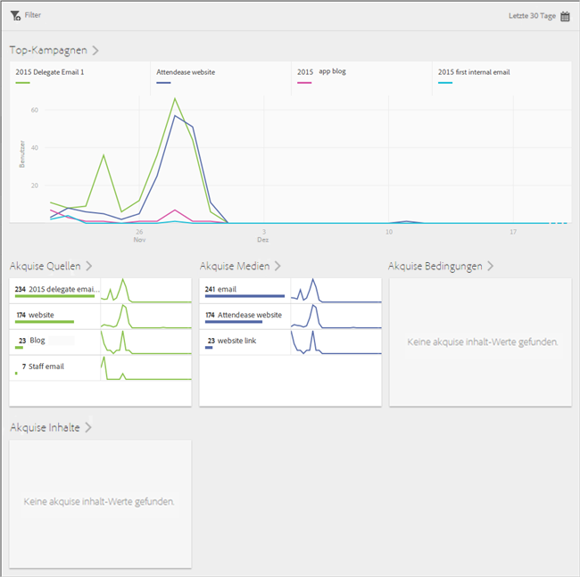

# Akquise {#acquisition}

Marketingexperten können Tracking-Links erstellen, um ihre Apps zu bewerben und mit Traffic zu versorgen. Diese Tracking-Links können Benutzer zu Appstores, App-Deep-Links und Zwischenräumen führen, die mit dem In-App-Verhalten korreliert werden können. Marketing-Experten können je nach Bedarf einen Link erstellen, um Benutzer zu iOS-, Android- oder anderen Plattformen zu leiten.

## Neue Adobe Experience Cloud SDK-Version

Sind Sie auf der Suche nach Informationen und Dokumentation zu Mobile SDK für die Adobe Experience Platform? Klicken Sie [hier](https://aep-sdks.gitbook.io/docs/), um unsere aktuelle Dokumentation abzurufen.

Seit September 2018 steht eine neue, bessere Version des SDK zur Verfügung. Diese neuen Adobe Experience Platform Mobile SDK können über [Experience Platform Launch](https://www.adobe.com/de/experience-platform/launch.html) konfiguriert werden.

* Gehen Sie zu [Launch](https://launch.adobe.com/), um zu beginnen.
* Gehen Sie zu [Github: Adobe Experience Platform SDK](https://github.com/Adobe-Marketing-Cloud/acp-sdks), um zu sehen, was in den Experience Platform SDK-Repositorys enthalten ist.

>[!IMPORTANT]
>
> Wenn Sie die Mobile SDK für Adobe Experience Platform mit Adobe Launch verwenden, **müssen** Sie außerdem die Adobe Analytics Mobile Services-Erweiterung installieren, um die Funktionen von Adobe Mobile Services wie Akquise-Links zu verwenden. Weitere Informationen finden Sie unter [Adobe Analytics – Mobile Services](https://aep-sdks.gitbook.io/docs/using-mobile-extensions/adobe-analytics-mobile-services). Weitere Informationen zur Verwendung von Akquise- und Marketinglinks mit Experience Cloud-SDK finden Sie unter [Akquise und Marketinglinks](https://aep-sdks.gitbook.io/docs/using-mobile-extensions/adobe-analytics-mobile-services#acquisition-and-marketing-links).

>[!IMPORTANT]
>
>Sie können zwar Funktionen in der Benutzeroberfläche konfigurieren, jedoch sind diese Funktionen nur verfügbar, wenn Sie die generierte Konfigurationsdatei herunterladen und zum SDK hinzufügen. Informationen zum Herunterladen und Konfigurieren der SDK finden Sie im Abschnitt *SDK-Dokumentation* auf dieser Seite.

Sie können Berichte zu verfolgbaren Marketinglinks mobiler Apps erstellen, bearbeiten, verwalten und anzeigen.

>[!TIP]
>
>Diese Funktion erfordert die Adobe Analytics – Mobile Apps- oder Adobe Analytics Premium-SKU.

Folgende Akquiseberichte bieten Einblicke in die Performance Ihrer Marketinglinks:

* **Übersicht**{#section_5B2BA47F22694919A472AB591101237E}

   Dieser Bericht enthält die Topkampagnen, die Benutzer zu Ihrer App geführt haben, einschließlich Informationen dazu, welche Performance die Kampagnen über andere Tracking-Metadaten, wie z. B. Akquisequelle, Medium, Dauer und Inhalt, hinweg erzielt haben.

   

* **Link-Bericht** {#section_A23A640C363B43569D9D484CF49EA277}

   Dieser Bericht enthält eine Rangansicht Ihrer Marketinglinks nach Performance. Er zeigt nicht nur die Namen Ihrer Links zusammen mit den wichtigsten Leistungsmetriken, er kann außerdem angepasst werden. Weitere Informationen finden Sie in [Berichte anpassen](/help/using/usage/reports-customize/t-reports-customize.md).

   Beachten Sie die folgenden Informationen:

   * Klicken Sie auf die Pfeilsymbole in den Spaltenüberschriften, um die Daten in auf- oder absteigender Reihenfolge zu sortieren.
   * Um die Daten in ein PDF-Dokument zu exportieren, klicken Sie auf **[!UICONTROL Herunterladen]**.
   
