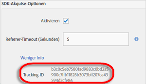

# Manually create Acquisition links {#create-acquisition-link-manually}

Sie können Marketing-Links erstellen, um sofort neue Benutzer von mobilen Apps zu akquirieren, indem Sie die URL-Parameter manuell konfigurieren.

>[!IMPORTANT]
>
>This feature requires SDK version 4.6 or later. For more information, see Acquisition prerequisites.

Das folgende Diagramm zeigt die Komponenten eines manuell erstellten Verfolgungslinks und die verschiedenen URL-Parameter, die Sie beim manuellen Erstellen von Akquise-Links ordnungsgemäß konfigurieren müssen.

Dieser Link ist so konfiguriert, dass er für eine mobile App eine plattformspezifische Weiterleitung an den Google Play Store oder den Apple App Store durchführt. Für den Fall, dass das Ziel nicht bestimmt werden kann, wurde der Apple App Store als Standard festgelegt. Nachdem die App installiert wurde, wird der benutzerdefinierte Kontextschlüssel `my.custom.key:test` an den Treffer für die Analytics-Installation angehängt.

Wenn Sie Links manuell erstellen, verwenden Sie das folgende URL-Format:

`http(s)://c00.adobe.com/v3/ {mobile-services-app-hash}/start? {parameters}`

>[!TIP]
>
>The version of Android SDK you are using has no impact on this process.

Stellen Sie bei iOS sicher, dass Sie das richtige Protokoll verwenden:

* Use **HTTP** if you are using the iOS SDKs before version 4.7.0, or if you are using iOS SDK 4.7.0 or later, and if **[!UICONTROL Use HTTPS]** is **not** selected on the Manage App Settings page.
* Use **HTTPS** if you are using iOS SDK 4.7.0 or later and **[!UICONTROL Use HTTPS]** **is** selected on the Manage App Settings page.

Wo folgende Bedingungen erfüllt wurden:

* `{mobile-services-app-hash}` stimmt mit der Anwendungskennung in der `acquisition:appid ` Konfigurationsdatei überein.

   You can locate `{mobile-services-app-hash}` in the Manage App Settings page under Acquisition SDK Options in the Tracking ID field.

   

* `{parameters}` is a list of standard specifically named URL query parameters.

Im Folgenden finden Sie eine Liste der Parameter:

* **`a_g_id`**

   App-Kennung für Google Play Store.

   * Sample value: `com.adobe.beardcons`

* **`a_g_lo`**

   Gebietsschema-Überschreibung für Google Play Store.

   * Beispielwert: `ko`

* **`a_i_id`**

   App-Kennung für iTunes.

   * Sample value: `835196493`

* **`a_i_lo`**

   Gebietsschema-Überschreibung für iTunes.

   * Beispielwert: `jp`

* **`a_dd`**

   Standard-Store für automatische Umleitung.

   * Beispielwert: `i | g`

* **`a_cid`**

   Benutzerdefinierte ID-Überschreibung (allgemein IDFA für iOS und ADID für Android).

   * Sample value: `Any String < 255 characters (UTF-8 encoded)`

* **`ctx*`**

   Keys prefixed with `ctx` will be in the context data of the resulting launch hit.

   * Beispielwert: `ctxmy.custom.key=myValue`

* **`ctxa.referrer.campaign.name`**

   Name der Akquise-Kampagne.

   Dieser Parameter ist für das Reporting erforderlich, wenn Sie die Performance verschiedener Akquise-Links vergleichen möchten.

   * Beispielwert: Gipfelkonferenz 2015

* **`ctxa.referrer.campaign.trackingcode`**

   Trackingcode

   Dieser Parameter ist für das Reporting erforderlich, wenn Sie die Performance verschiedener Akquise-Links vergleichen möchten.

   * Beispielwert: `lexsxouj`

* **`ctxa.referrer.campaign.source`**

   Die Quelle.

   * Beispielwert: Anzeigennetzwerk

* **`ctxa.referrer.campaign.medium`**

   Mittel

   * Beispielwert: Email

* **`ctxa.referrer.campaign.content`**

   Inhalt

   * Beispielwert: Bild Nr. 325689

* **`ctxa.referrer.campaign.term`**

   Begriff

   * Beispielwert: Wandern+Stiefel

Beachten Sie beim manuellen Erstellen von Akquise-Links die folgenden Informationen:

* Alle Parameter, die mit den in der oben stehenden Tabelle aufgeführten Parametern nicht übereinstimmen, werden als Teil der Appstore-Umleitung übergeben.
* Alle Parameter sind technisch optional, obwohl der Link nicht funktionsfähig ist, wenn mindestens eine Store-ID angegeben ist.

   An example of a store ID is `a_g_id`/ `a_i_id`.

* Wenn der Ziel-Store nicht automatisch bestimmt werden kann und kein Standardwert bereitgestellt wird, wird der Fehler 404 zurückgegeben.

