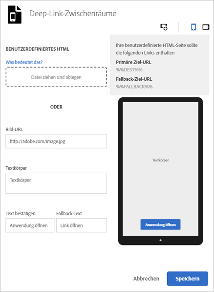

# Interstitials{#interstitials}

Sie können Benutzer abhängig davon, ob sie eine App installiert (App-Deep-Link) oder nicht installiert haben (Website oder Appstore), zu einem Ziel weiterleiten. Die Auswahl der Weiterleitung sollte am besten den Benutzern überlassen werden. Hierzu können Marketingexperten eine Zwischenraumseite konfigurieren, die Benutzern die verfügbaren Ziele anzeigen.

So konfigurieren Sie einen Zwischenraum, während Sie creating a Marketing Link:

1. Click **[!UICONTROL Edit Deep Link Interstitial]**.

   

1. Geben Sie Informationen in folgende Felder ein:

   * **[!UICONTROL Benutzerdefiniertes HTML]**

      Wählen Sie eine HTML-Seite aus, die als Kundenzwischenraum dienen soll.

      Durch die Verwendung benutzerdefinierter Zwischenräume können Marketingfachleute Zwischenraum-Einstiegsseiten mit benutzerdefiniertem HTML/CSS/JS anpassen, sodass Sie Ihre Seiten markieren können.

      Im Folgenden finden Sie die Anforderungen der HTML-Seite:

      * Sie muss im HTML-Format vorliegen.
      * Must contain the `%%DEST%%` and `%%FALLBACK%%` placeholders.
      * The uploaded HTML will be served in an `<iframe>`.

         Sie müssen sicherstellen, dass Ihre Link-Ziele auf das übergeordnete Fenster verweisen. You can include `<base target="_parent" />` in `<head>` or specify a target property for each `<a/>` individually.

         >[!TIP]
         >
         >Wenn Sie benutzerdefiniertes HTML hochladen, werden die anderen vier Optionen in dieser Tabelle nur verwendet, wenn Sie die hochgeladene Datei entfernen.
   * **[!UICONTROL Bild-URL]**

      Geben Sie die URL zu einem Bild-Asset ein.

   * **[!UICONTROL Textkörper]**

      Geben Sie den Textkörper für den Zwischenraum ein.

   * **[!UICONTROL Text bestätigen]**

      Geben Sie den Text für die Textschaltfläche ein.

   * **[!UICONTROL Fallback-Text]**

      Geben Sie den anzuzeigenden Fallback-Text ein.

      Über dieses Feld wird die Textschaltfläche aktualisiert, wenn ein Deep-Link fehlschlägt. Benutzer werden zuerst zum Deep-Link weitergeleitet, um diesen auszuprobieren, bevor ihnen der Fallback zu einer anderen Option ermöglicht wird. Ein Fallback kann z. B. zu einem Appstore erfolgen, um die App herunterzuladen und zu installieren, oder Benutzer werden zur Website des Unternehmens weitergeleitet. Über den Fallback-Text erfahren Benutzer, dass eine andere Option verfügbar ist, falls der Deep-Link fehlschlägt.

1. (**Optional**) Click the icons above the image to see how the interstitial looks rotated and on different devices.

   Sie können das Bild außerhalb von Mobile Services ändern oder bearbeiten, um sicherzustellen, dass es in verschiedenen Situationen korrekt angezeigt wird.
1. Klicken Sie auf **[!UICONTROL Speichern]**.
