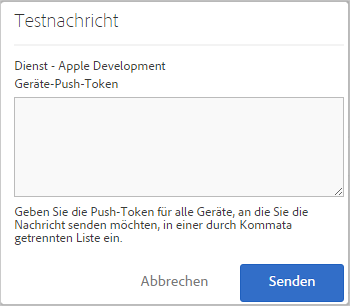

# Prerequisites to enable push messaging {#prerequisites-to-enable-push-messaging}

You must complete these tasks before configuring push messaging in your applications.

## Enable the Experience Cloud for your company

Ihr Adobe Analytics-Unternehmen muss Experience Cloud-fähig sein. Sie können den Status Ihres Adobe-Kundenbetreuers überprüfen.

## Mobile SDK installieren und konfigurieren

* **Mobiles SDK installieren**

   Um Push-Nachrichten zu konfigurieren, müssen Sie mindestens Version 4.6 oder höher des Mobile SDK herunterladen und installieren. For more information, see [Download the SDKs](/help/using/c-manage-app-settings/c-mob-confg-app/t-config-analytics/download-sdk.md).

* **Push-Dienste konfigurieren**

   Sie müssen Push-Dienste im mobilen SDK konfigurieren.
Weitere Informationen finden Sie unter folgenden Themen:

   * [Push-Nachrichten in Android](/help/android/messaging-main/push-messaging/push-messaging.md)
   * [Push-Nachrichten in iOS](/help/ios/messaging-main/push-messaging/push-messaging.md)

## Beim Mobile-Core-Service mit Ihrer Adobe ID anmelden

>[!IMPORTANT]
>
>Um die Funktion für Push-Dienste zu verwenden, müssen sich Benutzer beim Mobile-Core-Service mit ihrer Adobe ID anmelden und ihr Analytics-Konto muss mit ihren Adobe-IDs verknüpft sein. Die Funktion für Push-Dienste ist nicht verfügbar, wenn sich die Benutzer über ihre bestehenden Adobe Analytics-Konten anmelden.

Wenn Benutzer nicht über Adobe IDs verfügen, führen Sie folgende Schritte durch:

1. (**Experience Cloud Administrator**) Invite users to the Experience Cloud.

1. (**User**) Create a personal Adobe ID using the instructions that you received from the Experience Cloud administrator.

   Nachdem der Administrator den vorherigen Schritt durchgeführt hat, wird an jeden Benutzer automatisch eine E-Mail gesendet.

1. (**Users**) Log in to Mobile using their Adobe ID.

## Link users' accounts in the Experience Cloud

Jeder Benutzer muss das Analytics-Konto innerhalb der Experience Cloud-Organisation verknüpfen.

1. Um sich mit einer Adobe ID bei der Experience Cloud anzumelden, geben Sie in einem Browser [https://marketing.adobe.com](https://marketing.adobe.com) ein.

1. Wählen Sie oben rechts den Namen des Analytics-Unternehmens aus.

1. Klicken Sie auf **[!UICONTROL Unternehmen hinzufügen]** und wählen Sie aus der Dropdownliste **Adobe SiteCatalyst/Adobe Social]aus.[!UICONTROL **

1. Geben Sie den Unternehmensnamen sowie Ihre alten Anmeldedaten für das angegebene Unternehmen ein und klicken Sie auf **[!UICONTROL Konto verknüpfen]**.

   Die Adobe ID ist jetzt mit Ihrem Analytics-Konto, -Unternehmen und den zugehörigen Anmeldedaten verknüpft.

Weitere Informationen finden Sie unter [Fehlerbehebung bei der Kontoverknüpfung](https://marketing.adobe.com/resources/help/en_US/mcloud/organizations.html).

## Push-Dienste und den SDK-ID-Dienst in der Mobile-Benutzeroberfläche konfigurieren

Bevor Sie den ID-Dienst für Ihre App aktivieren, ist der Abschnitt **[!UICONTROL Push-Dienste]deaktiviert.** Nach der Aktivierung des ID-Diensts ist jedoch der Abschnitt "Push-Dienste"aktiviert. Weitere Informationen zum Aktivieren von Push-Diensten finden Sie unter SDK-ID-Dienstoptionen [konfigurieren](/help/using/c-manage-app-settings/c-mob-confg-app/t-config-visitor.md).

>[!IMPORTANT]: Sie müssen auf **[!UICONTROL Speichern]** klicken, um Ihre Änderungen zu speichern und die Push-Dienste zu aktualisieren.
>
>Sie können pro Report Suite eine Appstore-App für Apple und eine für Google konfigurieren. Wenn Sie verschiedene Apps benötigen, z. B. eine für die Produktions- und eine andere für die Entwicklungsumgebung, richten Sie eine neue Appstore-App und eine neue Report Suite für jede Umgebung ein.

* **Apple:** Ziehen Sie Ihren privaten Schlüssel und/oder Ihr Zertifikat per Drag and Drop hierher. Wenn der private Schlüssel passwortverschlüsselt ist, geben Sie das entsprechende Passwort ein.

   * **Privater Schlüssel:** Ziehen Sie die Datei mit dem privaten Schlüssel per Drag and Drop in das Feld.

      Sie können auch auf **[!UICONTROL Durchsuchen]klicken und die Datei auswählen.** Dieses Feld zeigt den privaten Schlüssel. The certificate might also be included in this file (`.p12`, `pkcs12`, `.pfx`, `.key`, `.pem`).

   * **Kennwort für privaten Schlüssel:** Wenn Ihr privater Schlüssel verschlüsselt ist, geben Sie das Passwort ein.

      **Zertifikat:** Wenn noch kein Zertifikat aus der Schlüsseldatei vorhanden ist, ziehen Sie die Zertifikatsdatei in das Feld. Sie können auch auf **[!UICONTROL Durchsuchen]klicken und die Datei auswählen.** This field is not required if the private-key file also contains the certificate ( `.cert`, `.cer`, `.crt`, `.pem`).

* **Google:** Geben Sie den API-Schlüssel für die App an.

   Klicken Sie auf **[!UICONTROL Testen], um zu überprüfen, ob App und Mobile Services richtig konfiguriert sind.** Diese Option ist nützlich zum Debugging und zur Fehlerbehebung.

   Geben Sie die Push-Token des Geräts ein, an die Sie die Nachricht senden möchten. Sie können die Nachricht an mehrere Geräte senden, indem Sie Token in einer durch Kommata getrennten Liste angeben.

   
