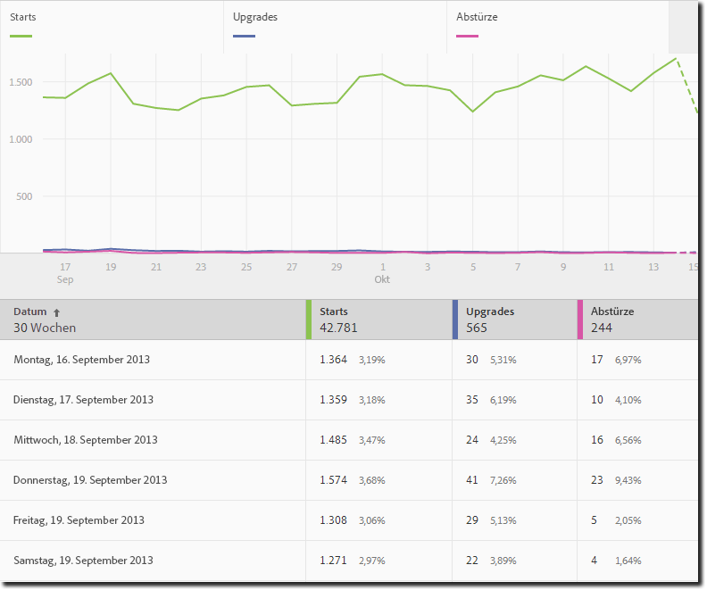
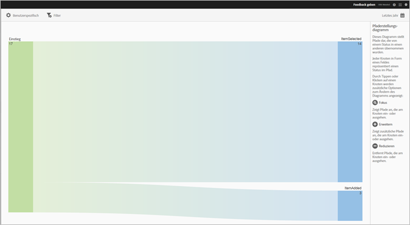

# Berichtstypen {#report-types}

Aufgrund der vielfältigen Möglichkeiten beim Anpassen von Berichten stellt sich vielleicht die Frage, welcher Typ von Bericht am besten geeignet ist, um die gewünschten Daten zu erhalten.

Bevor Sie Berichte anpassen, müssen Sie den Unterschied zwischen einer Metrik und einer Dimension verstehen.

* Metrik

   Eine Metrik dient zum Messen Ihrer Daten. Metriken sind Werte, die gezählt und hinzugefügt werden können und anhand derer ermittelt wird, wie oft bestimmte Aktionen in Ihrer App stattfinden. Zu den gebräuchlichsten Metriken gehören die Anzahl von Installations-, Start- und Anmeldevorgängen sowie der Umsatz und der Lebenszeitwert. So wird zum Beispiel bei jedem Start Ihrer App der Wert für „_launches_value“ um einen Zähler erhöht.

* Dimension

   Eine Dimension dient zum Beschreiben Ihrer Daten. Dimensionen werden mittels einer Zeichenfolge oder einer Zahl, die wie eine Zeichenfolge funktioniert (z. B. eine Postleitzahl) dargestellt. Sie werden genutzt, um Daten zu strukturieren und zu unterteilen. Beispiele für gängige Dimensionen sind Betriebssystemversion, Kampagne, Produktname und Mobilnetzbetreiber. Jede Dimension verfügt über eine Reihe spezifischer Werte, die mit dieser Dimension verknüpft sind. So verfügt zum Beispiel die Dimension „Betriebssystemversion“ über Werte wie _iOS 7_ und _Android 4.1.2_.

Im Folgenden finden Sie die Berichtstypen, die Sie in der Mobile-Benutzeroberfläche erstellen können:

## Zeitverlaufsbericht {#section_2741DA54C90C49AFB17C7B9BC7AD627D}

Zeitverlaufsberichte zeigen die Leistung von Metriken über einen bestimmten Zeitraum an, sodass Sie Spitzen und Trends schnell identifizieren können. Analysen werden oft in einem Zeitverlaufsbericht Beginn und in Trend- und Rangberichte umgewandelt, während Sie im Drilldown-Verfahren die Faktoren untersuchen, die zu einer Metrikspitze oder einem Trend beitragen könnten.

Wenn Sie z. B. eine Spitze bei Startvorgängen sehen, können Sie einen Trendbericht ausführen, der die Starts für die fünf wichtigsten Betriebssysteme anzeigt, um zu sehen, welche Betriebssysteme am meisten zur Spitze bei Startvorgängen beitragen:

Zur Ansicht von Dimensionswerten mit anderen Metriken in einem Zeitverlaufsbericht können Sie die Metrik Instanzen verwenden und einen Dimensionsfilter definieren.

## Trendbericht {#section_C9BE9A2EDBFF4D938B9AF14C8AA67883}

Trendberichte zeigen Ihnen, welche Leistung Ihre beliebtesten Dimensionen im Vergleich zu einer Metrik zeigen. Mit diesem Bericht können Sie ermitteln, welche Werte am meisten zu einer Änderung der Metrik beitragen.

Um einen Trendbericht für eine Dimension Ansicht, fügen Sie einen fixierbaren Filter (z. B. Betriebssystem = iOS 6.0.1) zu einem Zeitverlaufsbericht hinzu, um dieselben Daten Ansicht. Als Bonus können Sie dem gefilterten Zeitverlaufsbericht fünf zusätzliche Metriken hinzufügen.

## Gefilterter Zeitverlaufsbericht {#section_F8FAF2A4496F449CA99EF1E052C71A2D}

Wenn Sie einen bestimmten Dimensionswert haben, der Ansicht werden soll, können Sie einem Zeitverlaufsbericht einen fixierbaren Filter hinzufügen. Der folgende Bericht zeigt den Wert von 30 Tagen für Starts, Upgrades und Abstürze einer bestimmten Betriebssystemversion an.

## Rangbericht {#section_C073D744A95843AF99EE74FB5B013735}

Rangberichte zeigen Ihnen, wie oft die Top-50-Dimension zu einer Metrik beiträgt. Dieser Bericht ist hilfreich, um den Gesamtbeitrag für einen Datumsbereich über eine große Anzahl von Werten hinweg Ansicht.

## Sunburst-Bericht {#section_17A9842039174DE094A6B1E9837E35BB}

Sunburst-Berichte bestehen beispielsweise aus dem Basisbericht und Aufschlüsselungen. Die Visualisierung verwendet Höhe, um die Metrik und die Leistungsunterschiede zwischen den Metriken anzuzeigen. Jeder konzentrische Kreis stellt ein Audiencen-Segment in der Kategorie für diesen Kreis dar. Sie können Aktionen für eine Audience ausführen, z. B. einen fixierbaren Filter anwenden, eine Metrik ausblenden und Metriken anzeigen.

Sie können den Bericht in einem produktinternen Lernprogramm Ansicht geben, in dem beschrieben wird, wie Sie mit einem Sunburst-Diagramm interagieren.

Beginn des Lernprogramms:

1. Klicken Sie unter App-Einstellungen verwalten auf **[!UICONTROL Nutzung]**.

1. Click **[!UICONTROL Technology]** > **[!UICONTROL Technology Breakdown]**.
1. Klicken Sie in der Titelleiste des Berichts auf **[!UICONTROL Benutzerspezifisch]** und anschließend auf das Informationssymbol.

### Pfadsetzungsbericht {#section_AD400106BC684B50B27CCCD3F4497114}

Ein Pfadsetzungsbericht basiert auf der Analyse des Pfades und zeigt ein Pfaddiagramm an, das Pfade darstellt, die von einem Status in der App zu einem anderen Status genommen werden.

Jeder Knoten ist wie ein Feld geformt und stellt einen Status in den Pfaden der Benutzer durch eine App dar. In oben stehender Abbildung beispielsweise stellt der oberste Knoten die Anzahl der Benutzer dar, die die App gestartet und ein Foto aus der Galerie ausgewählt haben.

### Trichterbericht {#section_AF3B0C899D844FC3AD1F91A2C452C92F}

Trichterberichte ermöglichen es Ihnen, herauszufinden, wo Kunden eine Marketing-Kampagne verlassen oder von einem definierten Konversionspfad abweichen, während sie mit Ihrer mobilen App interagieren. Sie können den Trichterbericht auch dazu verwenden, die Aktionen verschiedener Segmente zu vergleichen.

Mit der Trichtervisualisierung können Sie sehen, wo Kunden aus dem Prozess aussteigen. Wenn Sie sich bei jedem Schritt einen Überblick über Kundenentscheidungen verschaffen, können Sie erkennen, wo Kunden abgeschreckt werden, welchen Pfad sie normalerweise verfolgen und wann sie Ihre App verlassen.

