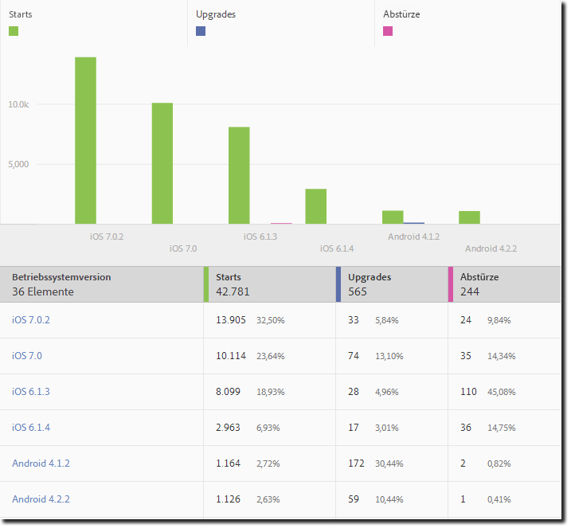

# Berichtstypen {#report-types}

Aufgrund der vielfältigen Möglichkeiten beim Anpassen von Berichten stellt sich vielleicht die Frage, welcher Typ von Bericht am besten geeignet ist, um die gewünschten Daten zu erhalten.

Bevor Sie Berichte anpassen, sollten Sie den Unterschied zwischen einer Metrik und einer Dimension kennen.

* Metrik

   Eine Metrik dient zum Messen Ihrer Daten. Metriken sind Werte, die gezählt und addiert werden können. So können Sie erkennen, wie oft bestimmte Aktionen in Ihrer App erfolgen. Zu den gebräuchlichsten Metriken gehören die Anzahl von Installations-, Start- und Anmeldevorgängen sowie der Umsatz und der Lebenszeitwert. So wird zum Beispiel bei jedem Start Ihrer App der Wert  für _launches_value wird um 1 erhöht.

* Dimension

   Eine Dimension dient zum Beschreiben Ihrer Daten. Dimensionen werden durch eine Zeichenfolge dargestellt, oder durch eine Zahl, die wie eine Zeichenfolge funktioniert (z. B. eine Postleitzahl), und die zum Organisieren und Segmentieren Ihrer Daten verwendet wird. Zu den gebräuchlichsten Dimensionen zählen beispielsweise die Betriebssystemversion, der Kampagnenname, der Produktname und der Mobilnetzbetreiber. Jede Dimension verfügt über eine Anzahl spezifischer Werte, die mit dieser Dimension verknüpft sind. For example, the OS version dimension has values such as _iOS 7_ and _Android 4.1.2_.

Im Folgenden finden Sie die Berichtstypen, die Sie in der Mobile-Benutzeroberfläche erstellen können:

## Zeitverlaufsbericht {#section_2741DA54C90C49AFB17C7B9BC7AD627D}

Zeitverlaufsberichte zeigen, wie sich Metriken über einen bestimmten Zeitraum entwickeln. So können Spitzenwerte und Trends leicht erkannt werden. Eine Analyse beginnen Sie oftmals in einem Zeitverlaufsbericht und wechseln dann in Trend- und Rangberichte, die Sie weiter aufschlüsseln, um herauszufinden, welche Faktoren für einen bestimmten Spitzenwert oder einen Trend bei einer Metrik verantwortlich sind.

Wenn beispielsweise ein Spitzenwert bei Startvorgängen auftritt, können Sie einen Trendbericht ausführen, der die Anzahl der App-Starts aufgeschlüsselt nach den fünf wichtigsten Betriebssystemen anzeigt. So können Sie feststellen, welches Betriebssystem am meisten zum Anstieg an Starts beigetragen hat:

Sollen in einem Zeitverlaufsbericht neben anderen Metriken auch Dimensionswerte angezeigt werden, können Sie unter Verwendung der Metrik „Instanzen“ einen Dimensionsfilter definieren.

## Trendbericht {#section_C9BE9A2EDBFF4D938B9AF14C8AA67883}

Mit Trendberichten können Sie die Metrikperformance Ihrer beliebtesten Dimensionen ermitteln. Mithilfe dieses Berichts können Sie bestimmten, welche Werte am meisten zur Änderung einer Metrik beitragen.

Wenn Sie einen Trendbericht für eine Dimension anzeigen möchten, fügen Sie einem Zeitverlaufsbericht einen fixierbaren Filter hinzu (z. B. Betriebssystem = iOS 6.0.1), um so die gleichen Daten zu erhalten. Darüber hinaus können Sie fünf zusätzliche Metriken zum gefilterten Zeitverlaufsbericht hinzufügen.

## Gefilterter Zeitverlaufsbericht {#section_F8FAF2A4496F449CA99EF1E052C71A2D}

Wenn Sie einen bestimmten Dimensionswert im Auge behalten möchten, können Sie einen fixierbaren Filter verwenden, den Sie einem Zeitverlaufsbericht hinzufügen. Der folgende Bericht zeigt die Werte der letzten 30 Tage für Starts, Upgrades und Abstürze auf einer bestimmten Betriebssystemversion an.

## Rangbericht {#section_C073D744A95843AF99EE74FB5B013735}

Rangberichte zeigen Ihnen, wie oft die 50 wichtigsten Dimensionen zu einer Metrik beigetragen haben. Dieser Bericht ist hilfreich, wenn Sie wissen möchten, wie groß der Gesamtbeitrag in einem bestimmten Datumsbereich bei einer großen Anzahl von Werten war.

## Sunburst-Bericht {#section_17A9842039174DE094A6B1E9837E35BB}

Sunburst-Berichte bestehen beispielsweise aus dem Basisbericht und Aufschlüsselungen. Dabei werden Metriken durch entsprechende Höhen visualisiert, sodass Performanceunterschiede leicht erkennbar sind. Jeder konzentrische Ring stellt ein Zielgruppensegment in der Kategorie des entsprechenden Rings dar. An einer Zielgruppe können Sie auch Aktionen durchführen, wie zum Beispiel einen fixierbaren Filter anwenden sowie Metriken ausblenden oder anzeigen.

Sie können ein produktinternes Tutorial aufrufen, in dem beschrieben wird, wie Sie mit einer Sunburst-Grafik interagieren.

So starten Sie das Tutorial:

1. Klicken Sie unter App-Einstellungen verwalten auf **[!UICONTROL Nutzung]**.

1. Click **[!UICONTROL Technology]** &gt; **[!UICONTROL Technology Breakdown]**.
1. In the title bar of the report, click **[!UICONTROL Customize]**, and click the information icon.

### Pfadsetzungsbericht {#section_AD400106BC684B50B27CCCD3F4497114}

Ein Pfadsetzungsbericht basiert auf einer Pfadanalyse und enthält ein Pfaddiagramm, das die Pfade darstellt, auf denen sich Benutzer von einem App-Status zu einem anderen bewegt haben.

Jeder Knoten ist kastenförmig und stellt einen Status auf den Pfaden der Benutzer durch eine App dar. In der oben stehenden Abbildung beispielsweise stellt der oberste Knoten die Anzahl der Benutzer dar, die die App gestartet und ein Foto aus der Galerie ausgewählt haben.

### Trichterbericht {#section_AF3B0C899D844FC3AD1F91A2C452C92F}

Mit Trichterberichten können Sie feststellen, wo Kunden bei der Interaktion mit Ihrer App eine Marketing-Kampagne verlassen haben oder von einem definierten Konversionspfad abgewichen sind. Sie können den Trichterbericht auch dazu verwenden, die Aktionen verschiedener Segmente zu vergleichen.

Die Trichtervisualisierung zeigt, an welcher Stelle Kunden aus dem Prozess fallen. Indem Sie Einblicke in Kundenentscheidungen bei jedem Schritt erhalten, können Sie nachvollziehen, wo die Kunden zurückgehalten werden, welchem Pfad sie für gewöhnlich folgen und wann sie die App verlassen.

