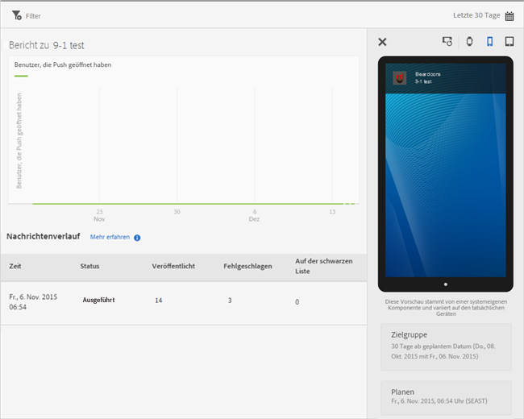

# View message reports{#view-message-reports}

Sie können Nachrichtenberichte für In-App- und Push-Nachrichten anzeigen.

1. Click  in the **[!UICONTROL Report]** column for a message.
1. (**Optional**) Create a sticky filter for the report or change the time period by clicking the **[!UICONTROL Calendar]** icon.

   Weitere Informationen zum Erstellen eines fixierbaren Filters finden Sie unter [fixierbaren Filter hinzufügen](/help/using/usage/reports-customize/t-sticky-filter.md).

>[!TIP]
>
>Je nach angezeigtem Nachrichtentyp kann der Bericht variieren.

## In-App-Nachrichten {#section_90B79BA58E8141F78538C187EB1BF8C7}

Wenn Sie Berichte für eine In-App-Nachricht anzeigen, sieht der Bericht ähnlich wie in der folgenden Abbildung aus:

### In-App-Nachrichtenmetriken

Hier finden Sie eine Liste der Metriken, die für In-App-Nachrichten verfügbar sind:

* **[!UICONTROL Impression]**, wenn eine Nachricht ausgelöst wird.

* **[!UICONTROL Klicken Sie auf]**, wenn ein Benutzer auf die Schaltfläche **[!UICONTROL "Durchklickrate"]** einer Warnung oder Vollbildnachricht klickt und wenn ein Benutzer die App über eine lokale Benachrichtigung öffnet.

* **[!UICONTROL Abbrechen,]** wenn ein Benutzer auf einer Warnmeldung **[!UICONTROL oder in einer Vollbildnachricht auf]** die Schaltfläche "Abbrechen" klickt.

* **[!UICONTROL Interaktionsrate]**, eine berechnete Metrik aus Adobe Analytics und ist das Ergebnis der Anzahl der Durchklicks geteilt durch die Anzahl der Impressionen.

## Push messages {#section_BEAFD858CA194185B6F88903446058E9}

Wenn Sie Berichte für eine Push-Nachricht anzeigen, sieht der Bericht ähnlich wie in der folgenden Abbildung aus:

In dem Diagramm oben wird die Anzahl der Benutzer angezeigt, die die Nachricht geöffnet haben.

### Metriken für Push-Nachrichten

Hier finden Sie eine Liste der Metriken, die für Push-Nachrichten verfügbar sind:

* **[!UICONTROL Zeit]**

   Der Zeitpunkt, zu dem die Nachricht von Mobile Services per Push an Geräte gesendet wurde.

* **[!UICONTROL Status]**

   Der Status der Nachricht und die verfügbaren Status lauten:

   * **[!UICONTROL Abgebrochen]**
   * **[!UICONTROL Geplant]**
   * **[!UICONTROL Wird ausgeführt]**
   * **[!UICONTROL Ausgeführt]**

* **[!UICONTROL Veröffentlicht]**

   Die Anzahl der Gerätetoken, die erfolgreich an Apple Push Notification Service/Firebase Cloud Messaging (APNS/FCM) gesendet wurden, um die Nachricht an die Benutzer zu senden.

* **[!UICONTROL Fehlgeschlagen]**

   Die Anzahl der Gerätetoken, die nicht erfolgreich an APNS/FCM gesendet wurden. Mögliche Ursachen für Fehler:

   * Die pushID ist ungültig.

   * Die Push-Plattform (APNS, FCM usw.), die für die Push-Übertragung bereitgestellt wurde, ist für die Anwendungsanwendung nicht vorhanden. So könnte die Plattform z. B. iOS-Push-Token erfassen, während aber kein APNS-Service konfiguriert ist.

   * Die Nachricht kann auch fehlgeschlagen sein, weil der Push-Dienst nicht richtig konfiguriert war oder das Mobile Services-System ausgefallen ist.
   >[!IMPORTANT]
   >
   >Wenn es ungewöhnlich oft zu einem Fehlschlag kommt, überprüfen Sie die Konfiguration der Push-Dienste. Wenn die Push-Dienste korrekt konfiguriert zu sein scheinen, wenden Sie sich an die Adobe-Kundenunterstützung.

* **[!UICONTROL Auf der schwarzen Liste]**

   Die Anzahl der Gerätetoken, die nicht mehr gültig sind, um an APNS oder FCM gesendet zu werden. Dies bedeutet meist, dass die App vom Gerät deinstalliert wurde oder dass der Benutzer seine Teilnahmeeinstellungen für den Erhalt von Nachrichten geändert hat. Android und iOS verhalten sich unterschiedlich, wenn Token als in der Blacklist vorhandene Token gezählt werden. Android-Token erscheinen sofort in der Anzahl der Token auf der schwarzen Liste. iOS-Token werden anfangs als veröffentlicht angezeigt, in nachfolgenden Nachrichten gelten sie jedoch aufgrund des Feedbacks von APNS als in der Blacklist vorhanden.
