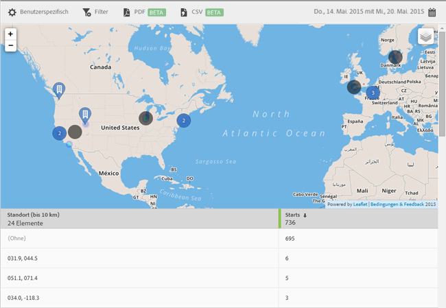

# Landkarte {#map}

Sie können eine interaktive Landkarte anzeigen, auf der Ihre Zielpunkte und andere Datenmarkierungen dargestellt werden.

Im Folgenden einige wichtige Hinweise:

* Sie können die Landkarte vergrößern oder verkleinern.

   Diese Funktion ist beispielsweise nützlich, wenn zwei Zielpunkte nahe beieinanderliegen. Durch Vergrößern der Karte werden mehr Details angezeigt.
* Die Zielpunkte werden blau dargestellt.

   Alte Datenmarkierungen, wie z. B. Starts, werden schwarz dargestellt. Klicken Sie auf eine Markierung, um weitere Informationen anzuzeigen.

Wenn Sie auf  klicken, können Sie zwischen folgenden Optionen wählen:

* **[!UICONTROL Landkarte]**

   Zum Anzeigen einer einfachen Karte.

* **[!UICONTROL Satellit]**
Zum Anzeigen der Landkarte im Satellitenmodus.

* **[!UICONTROL Datenmarkierungen]**

   Zum Festlegen, ob schwarze Datenmarkierungen angezeigt werden sollen.

* **[!UICONTROL Heatmap]**

   Zum Festlegen, ob Heatmap-Markierungen angezeigt werden sollen. Je intensiver die Farbe, desto häufiger wird die Bedingung (z. B. Starts) erfüllt.

* **[!UICONTROL POI]**

   Zum Festlegen, ob Ihre Zielpunkte angezeigt werden sollen.

Für diesen Bericht können folgende Optionen konfiguriert werden:

* **[!UICONTROL Zeitraum]**

   Klicken Sie auf das **[!UICONTROL Kalendersymbol]** und wählen Sie einen benutzerdefinierten oder einen vorgegebenen Zeitraum aus der Dropdownliste aus.

* **[!UICONTROL Anpassen]**

   Passen Sie Ihre Berichte an, indem Sie beispielsweise die Option **[!UICONTROL Anzeigen nach]** ändern oder Metriken und Filter bzw. zusätzliche Reihen (Metriken) hinzufügen. Weitere Informationen finden Sie in [Berichte anpassen](/help/using/usage/reports-customize/t-reports-customize.md).

* **[!UICONTROL Filter]**

   Klicken Sie auf **[!UICONTROL Filter]**, um einen Filter zu erstellen, der verschiedene Berichte umfasst. Auf diese Weise können Sie die Performance eines Segments für alle Mobilberichte anzeigen. Mit einem fixierbaren Filter können Sie einen Filter definieren, der auf alle Berichte (außer auf Pfadsetzungsberichte) angewendet werden kann. Weitere Informationen finden Sie in [Fixierbaren Filter hinzufügen](/help/using/usage/reports-customize/t-sticky-filter.md).

* **[!UICONTROL Download]**

   Klicken Sie auf **[!UICONTROL PDF]** oder **[!UICONTROL CSV]**, um Dokumente herunterzuladen bzw. zu öffnen und diese mit Benutzern zu teilen, die keinen Zugriff auf Mobile Services haben, oder in Präsentationen zu verwenden.