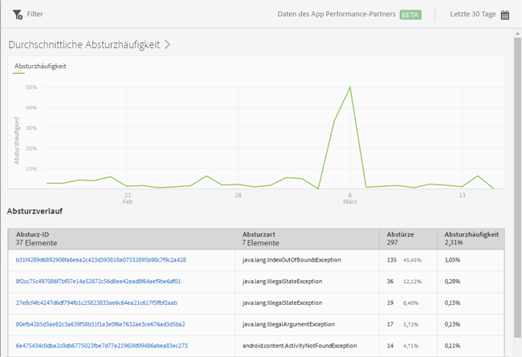

# Crashes report {#crashes}

Der Bericht **[!UICONTROL Abstürze]zeigt eine Momentaufnahme der Abstürze Ihrer App.** Er enthält die Anzahl der Abstürze, die Absturzhäufigkeit sowie die Anmeldungen bei der Apteligent-Benutzeroberfläche.

>[!IMPORTANT]
>
>To display the **[!UICONTROL Crashes]** report in the left navigation, you must first integrate your app with Apteligent.

The **[!UICONTROL Average Crash Rate]** graph displays the crash rate by date. Sie können mit dem Mauszeiger über ein Datum fahren, um die Absturzhäufigkeit an diesem Tag anzuzeigen.

The **[!UICONTROL Crash History]** chart displays information about each app crash, including the crash ID, crash type, number or crashes, and the crash date. Um sich bei Apteligent anzumelden und weitere Details zu einem Absturz anzuzeigen, klicken Sie auf den Link in der Spalte **[!UICONTROL Absturz-ID].**

Für diesen Bericht können folgende Optionen konfiguriert werden:

* **[!UICONTROL Zeitraum]**

   Klicken Sie auf das **[!UICONTROL Kalendersymbol]und wählen Sie einen benutzerdefinierten oder einen vorgegebenen Zeitraum aus der Dropdownliste aus.**

* **[!UICONTROL Filter]**

   Klicken Sie auf **[!UICONTROL Filter], um einen Filter zu erstellen, der verschiedene Berichte umfasst. Auf diese Weise können Sie die Performance eines Segments für alle Mobilberichte anzeigen.** Mit einem fixierbaren Filter können Sie einen Filter definieren, der auf alle Berichte (außer auf Pfadsetzungsberichte) angewendet werden kann.

   Weitere Informationen finden Sie unter Add a sticky filter.