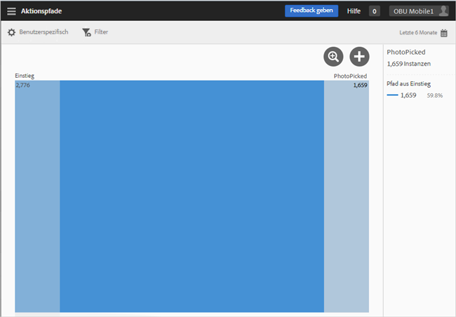
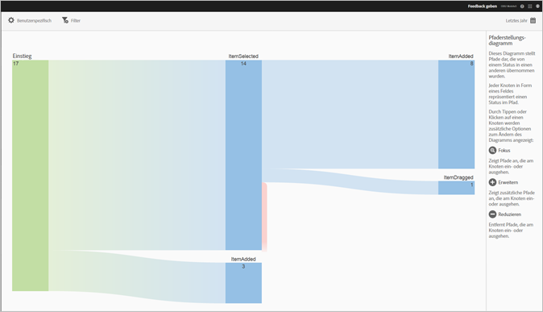

# Bericht „Action Paths“ {#action-paths}

Der Bericht „Aktionspfade“ dient der Pfadanalyse. Er zeigt ein Pfadsetzungsdiagramm an, in dem die Pfade dargestellt werden, die von einem App-Status zu einem anderen führen.

Bei den Berichten **[!UICONTROL Ansichtspfade]** und **[!UICONTROL Aktionspfade]** handelt es sich um Pfadsetzungsberichte. Im Bericht **[!UICONTROL Ansichtspfade]** wird angezeigt, wie Benutzer in der App von einem Bildschirm zum nächsten navigieren. Der Bericht **[!UICONTROL Aktionspfade]** zeigt die Abfolge von Aktionen und Ereignissen, wie z. B. Klicks, Auswahlen, Größenänderungen usw., die der Benutzer in Ihrer App durchführt.

>[!TIP]
>
>Sie können einen Trichterbericht verwenden, um Navigation und Aktionen in einem Bericht zu kombinieren. Weitere Informationen finden Sie in [Trichter](/help/using/usage/reports-funnel.md).

Jeder boxförmige Knoten stellt einen Status in den Pfaden der Benutzer durch eine App dar. In der obigen Grafik stellt der oberste Knoten beispielsweise die Anzahl der Benutzer dar, die die App gestartet und anschließend ein Foto aus der Galerie ausgewählt haben.

Um die Optionen zur Änderung des Diagramms anzuzeigen, klicken Sie auf einen Knoten und anschließend auf **[!UICONTROL Fokus]** oder **[!UICONTROL Erweitern]**. Wenn Sie beispielsweise im obersten Knoten auf den Status **[!UICONTROL PhotoPicked]** klicken, werden die Symbole **[!UICONTROL Fokus]** und **[!UICONTROL Erweitern]** angezeigt.

Klicken Sie zum Erweitern auf das **[!UICONTROL +]**-Symbol. Diese Option zeigt die zusätzlichen Pfade an, die in den Knoten eingehen oder aus ihm ausgehen. In der unten stehenden Grafik wird die App von Status 1 gestartet, von Status 2 wird ein Foto ausgewählt (das Element, das Sie zuvor erweitert haben), und Status 3 enthält die verschiedenen Pfade, die Benutzer verwendet haben:

* Auswählen eines Elements
* Hinzufügen eines Elements
* Ziehen eines Elements
* Skalieren eines Elements

Das Erweitern eines Status ähnelt einem Trichter.

Um den Knoten zu isolieren und Pfade anzuzeigen, die zum ausgewählten Pfad bzw. von ihm weg führen, klicken Sie auf das Symbol . In der unten stehenden Grafik wurden die folgenden Pfade abgeschlossen, **bevor** die Benutzer ein Foto ausgewählt haben:

* Drehen eines Elements
* Skalieren eines Elements
* Ziehen eines Elements
* Entfernen eines Elements

Von den Benutzern, die ein Foto ausgewählt haben, wurden die folgenden Pfade **nach** der Auswahl des Fotos abgeschlossen:

* Auswählen eines Elements
* Hinzufügen eines Elements
* Ziehen eines Elements
* Skalieren eines Elements

Sie können mehrere Knoten betrachten oder erweitern, um eine detaillierte Ansicht der Pfade zu erhalten, die Benutzer in Ihrer App verwenden. Beispiel:

Für diesen Bericht können folgende Optionen konfiguriert werden:

* **[!UICONTROL Zeitraum]**

   Klicken Sie auf das **[!UICONTROL Kalendersymbol]** und wählen Sie einen benutzerdefinierten oder einen vorgegebenen Zeitraum aus der Dropdown-Liste aus.

* **[!UICONTROL Anpassen]**

   Passen Sie Ihre Berichte an, indem Sie beispielsweise die Option **[!UICONTROL Anzeigen nach]** ändern oder Metriken und Filter bzw. zusätzliche Reihen (Metriken) hinzufügen. Weitere Informationen finden Sie in [Berichte anpassen](/help/using/usage/reports-customize/reports-customize.md).

* **[!UICONTROL Filter]**

   Klicken Sie auf **[!UICONTROL Filter]**, um einen Filter zu erstellen, der verschiedene Berichte umfasst. Auf diese Weise können Sie die Performance eines Segments für alle Mobilberichte anzeigen. Mit einem fixierbaren Filter können Sie einen Filter definieren, der auf alle Berichte (außer auf Pfadsetzungsberichte) angewendet werden kann. Weitere Informationen finden Sie in [Fixierbaren Filter hinzufügen](/help/using/usage/reports-customize/t-sticky-filter.md).

* **[!UICONTROL Herunterladen]**

   Klicken Sie auf **[!UICONTROL PDF]** oder **[!UICONTROL CSV]**, um Dokumente herunterzuladen bzw. zu öffnen und diese mit Benutzern zu teilen, die keinen Zugriff auf Mobile Services haben, oder in Präsentationen zu verwenden.