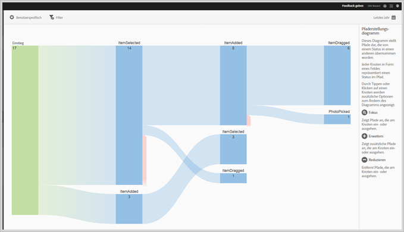

# Bericht „Action Paths“{#action-paths}

Der Bericht „Aktionspfade“ dient der Pfadanalyse. Er zeigt ein Pfadsetzungsdiagramm an, in dem die Pfade dargestellt werden, die von einem App-Status zu einem anderen führen.

Bei den Berichten **[!UICONTROL Ansichtspfade]** und **Aktionspfade]handelt es sich um Pfadsetzungsberichte.[!UICONTROL ** Im Bericht **[!UICONTROL Ansichtspfade]wird angezeigt, wie Benutzer in der App von einem Bildschirm zum nächsten navigieren.** Der Bericht **[!UICONTROL Aktionspfade]zeigt die Abfolge von Aktionen und Ereignissen, wie z. B. Klicks, Auswahlen, Größenänderungen usw., die der Benutzer in Ihrer App durchführt.**

>[!TIP]
>
>Sie können die Navigation und Aktionen in einem Bericht mithilfe eines Trichterberichts kombinieren. For more information, see [Funnel](/help/using/usage/reports-funnel.md).

Jeder boxförmige Knoten stellt einen Status in den Pfaden der Benutzer durch eine App dar. In der oben stehenden Grafik beispielsweise stellt der oberste Knoten die Anzahl der Benutzer dar, die die App gestartet und dann ein Foto aus der Galerie ausgewählt haben.

Um die Optionen zur Änderung des Diagramms anzuzeigen, klicken Sie auf einen Knoten und anschließend auf **[!UICONTROL Fokus]** oder **[!UICONTROL Erweitern]**. Wenn Sie beispielsweise im obersten Knoten auf den Status **[!UICONTROL PhotoPicked]** klicken, werden die Symbole **[!UICONTROL Fokus]und** Erweitern] angezeigt.**[!UICONTROL **

To expand, click the **[!UICONTROL +]** icon. Mit dieser Option werden zusätzliche Pfade angezeigt, die zum Knoten hin oder von ihm weg führen. In der unten stehenden Grafik entspricht Status 1 dem Starten der App und Status 2 der Auswahl eines Fotos (das zuvor erweiterte Element). Status 3 enthält die verschiedenen Pfade, auf denen sich Benutzer bewegt haben:

* Auswahl eines Elements
* Hinzufügen eines Elements
* Ziehen eines Elements
* Größenänderung eines Elements

Das Erweitern eines Status ähnelt einem Trichter.

To isolate the node and show paths that come into, and go out of the selected node, click the   icon. In der unten stehenden Grafik wurden folgende Pfade abgeschlossen, **bevor** Benutzer ein Foto ausgewählt haben:

* Drehen eines Elements
* Größenänderung eines Elements
* Ziehen eines Elements
* Entfernen eines Elements

Benutzer, die ein Foto ausgewählt haben, haben folgende Pfade abgeschlossen, **nachdem** das Foto ausgewählt wurde:

* Auswahl eines Elements
* Hinzufügen eines Elements
* Ziehen eines Elements
* Größenänderung eines Elements

Sie können mehrere Knoten fokussieren oder erweitern, um eine detaillierte Darstellung der Pfade zu erhalten, denen Benutzer in Ihrer App folgen. Beispiel:

Für diesen Bericht können folgende Optionen konfiguriert werden:

* **[!UICONTROL Zeitraum]**

   Klicken Sie auf das **[!UICONTROL Kalendersymbol]und wählen Sie einen benutzerdefinierten oder einen vorgegebenen Zeitraum aus der Dropdownliste aus.**

* **[!UICONTROL Anpassen]**

   Customize your reports by changing the **[!UICONTROL Show By]** options, adding metrics and filters, and adding additional series (metrics), and more. For more information, see [Customize reports](/help/using/usage/reports-customize/reports-customize.md).

* **[!UICONTROL Filter]**

   Klicken Sie auf **[!UICONTROL Filter], um einen Filter zu erstellen, der verschiedene Berichte umfasst. Auf diese Weise können Sie die Performance eines Segments für alle Mobilberichte anzeigen.** Mit einem fixierbaren Filter können Sie einen Filter definieren, der auf alle Berichte (außer auf Pfadsetzungsberichte) angewendet werden kann. Weitere Informationen finden Sie unter [fixierbaren Filter hinzufügen](/help/using/usage/reports-customize/t-sticky-filter.md).

* **[!UICONTROL Download]**

   Click **[!UICONTROL PDF]** or **[!UICONTROL CSV]** to download or open documents and share with users who do not have access to Mobile Services or to use the file in presentations.