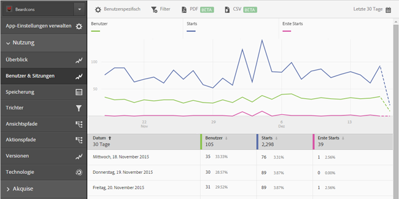
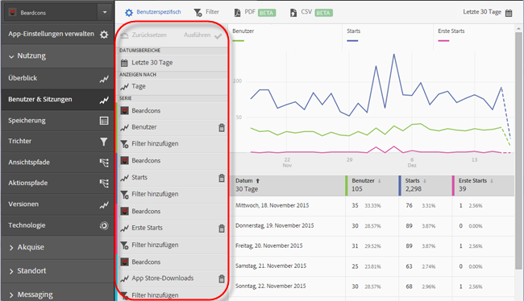

# Filter zu Berichten hinzufügen{#add-filters-to-reports}

Mithilfe dieser Informationen können Sie die integrierten Berichte durch Hinzufügen zusätzlicher Filter (Segmente) anpassen.

>[!IMPORTANT]
>
>App-Metriken sind auch in Marketing Reports &amp; Analytics, Ad-hoc-Analysen, Data Warehouse- und anderen Analytics-Schnittstellen für die Berichterstellung verfügbar. Wenn eine Aufschlüsselung oder ein Berichtstyp in Adobe Mobile nicht zur Verfügung steht, kann er mithilfe einer anderen Berichtsschnittstelle generiert werden.

Im folgenden Beispiel passen wir den Bericht **[!UICONTROL Benutzer und Sitzungen]** an, die Anweisungen gelten jedoch für alle Berichte.

1. Öffnen Sie Ihre App und klicken Sie auf **[!UICONTROL Nutzung]** &gt; **[!UICONTROL Benutzer und Sitzungen]**.

   

   Dieser Bericht enthält einen kompletten zeitlichen Überblick über unsere App-Nutzer. Allerdings werden hier Metriken sowohl für iOS- als auch für Android-Versionen in der gleichen Report Suite erfasst. Wir können die Benutzer nach ihrem mobilen Betriebssystem segmentieren, indem wir der Metrik „Benutzer“ einen benutzerdefinierten Filter hinzufügen.

1. Klicken Sie auf **[!UICONTROL Anpassen]**.

   

1. Klicken Sie unter **[!UICONTROL Benutzer]** auf **[!UICONTROL Filter hinzufügen]** und klicken Sie auf **[!UICONTROL Regel hinzufügen]**.

1. Wählen Sie **[!UICONTROL Betriebssysteme]** und anschließend **[!UICONTROL iOS]** aus der Dropdownliste aus.

   

   Wiederholen Sie diesen Schritt, um Android als Filter hinzuzufügen.

1. Klicken Sie auf **[!UICONTROL Und]**, wählen Sie **[!UICONTROL Betriebssysteme]** aus der Dropdownliste und anschließend **[!UICONTROL Android]** aus.

   Die Filter sollten jetzt wie folgt aussehen:

   

1. Klicken Sie auf **[!UICONTROL Aktualisieren]**.
1. Um den Bericht neu zu erstellen, klicken Sie auf **[!UICONTROL Ausführen]**.

   Dieser Bericht zeigt die Benutzer aufgeschlüsselt nach Betriebssystem an. Der Berichtstitel wurde entsprechend den angewendeten Filtern geändert.

   

   Sie können den Bericht aber noch weiter anpassen. Ab iOS 8.3 können Sie die Metrik „Erste Starts“ mit einem Filter für die Betriebssystemversion iOS 8.3 hinzufügen, um zu sehen, wie viele iOS 8.3-Kunden ihre Apps aktualisiert und einen ersten Start durchgeführt haben.
1. Klicken Sie unter **[!UICONTROL Erste Starts]** auf **[!UICONTROL Filter hinzufügen]** und dann auf **[!UICONTROL Regel hinzufügen]**. Wählen Sie aus der Dropdownliste den Eintrag **[!UICONTROL Betriebssysteme]** und dann **[!UICONTROL iOS]** aus.
1. Klicken Sie auf **[!UICONTROL Und]** und wählen Sie aus der Dropdownliste den Eintrag **[!UICONTROL Betriebssystemversionen]** und dann **[!UICONTROL iOS 8.3]** aus.

   Die Filter sollten jetzt wie folgt aussehen:

   

1. Klicken Sie auf **[!UICONTROL Aktualisieren]** und **[!UICONTROL Ausführen]**.

   Der Bericht zeigt jetzt die Benutzer mit iOS 8.3 an, die die App zum ersten Mal gestartet haben.

   

   Probieren Sie die verschiedenen Optionen im Berichtsanpassungsmenü ruhig einmal aus. Ihre Favoriten können Sie mit einem Lesezeichen versehen. Berichts-URLs in Adobe Mobile sind funktionsfähig und können per E-Mail versendet oder Ihren Favoriten hinzufügt werden.
