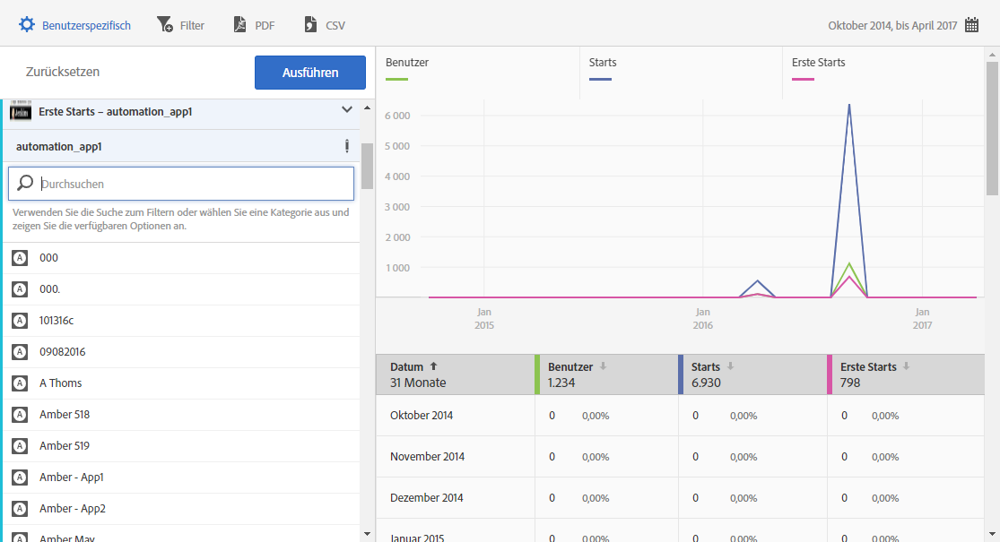

# Add series (metrics) to reports{#add-series-metrics-to-reports}

Mithilfe dieser Informationen können Sie die integrierten Berichte durch Hinzufügen zusätzlicher Reihen (Metriken) oder Apps in anderen Report Suites anpassen, um Daten zu vergleichen.

>[!IMPORTANT]
>
>Mobile App-Metriken sind auch in Marketing Reports &amp; Analysen, Ad-hoc-Analysen, Data Warehouse und anderen Benutzeroberflächenschnittstellen verfügbar. Wenn eine Aufschlüsselung oder ein Berichtstyp in Adobe Mobile nicht zur Verfügung steht, kann er mithilfe einer anderen Berichtsschnittstelle generiert werden.

In this example, we will customize the **[!UICONTROL Users &amp; Sessions]** report, but the instructions can apply to any report.

1. Öffnen Sie Ihre App und klicken Sie auf **Nutzung** &gt; **[!UICONTROL Benutzer und Sitzungen]**.

   

   Dieser Bericht enthält einen kompletten zeitlichen Überblick über unsere App-Nutzer. Wir möchten jedoch eine Reihe hinzufügen, um Informationen über App-Abstürze anzuzeigen.

1. Click **[!UICONTROL Customize]**.

   

1. Scroll down and click **[!UICONTROL Add Series]**.

   Der Name der Reihe wird mit dem Namen der letzten Reihe in der Liste ausgefüllt. In der vorigen Abbildung lautet die neueste Reihe **[!UICONTROL App Store-Downloads]**. Deshalb erhält auch die neu hinzugefügte Reihe den Namen **[!UICONTROL App Store-Downloads]**.

1. Führen Sie eine der folgenden Aufgaben aus:

   * Um eine neue Reihe (Metrik) hinzuzufügen, klicken Sie auf den Namen der eben erstellten Reihe und wählen Sie eine neue Lebenszyklusmetrik aus der Dropdownliste aus.

      

   * Um eine neue App in einer anderen Report Suite hinzuzufügen, damit Sie Daten über Apps hinweg vergleichen können, klicken Sie in der neu erstellten Reihe auf den App-Namen und wählen Sie die gewünschte App aus.

      

1. (Bedingt) Fügen Sie der neuen Reihe Filter hinzu.

   Weitere Informationen finden Sie unter [Filter zu Berichten hinzufügen](/help/using/usage/reports-customize/t-reports-customize.md).
1. Click **[!UICONTROL Update]** and **[!UICONTROL Run]**.
