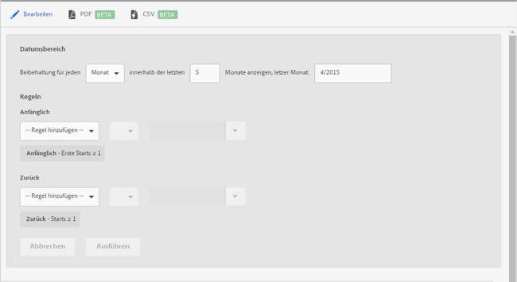

# Treuebericht {#retention}

{#eol}

Der **[!UICONTROL Treuebericht]** (ehemals „Erste-Start-Kohorten“) ist ein Kohortenbericht, in dem angezeigt wird, wie viele eindeutige Benutzer die App zum ersten Mal gestartet und dann in den Folgemonaten mindestens einmal erneut gestartet haben.

Dieser Bericht zeigt standardmäßig die Treue von Benutzergruppen an, basierend darauf, wann die Benutzer die App zum ersten Mal gestartet haben. Sie können diesen Bericht auch anpassen, um eine andere Metrik als „Erster Start“ zu verwenden und zusätzliche Aktionen hinzuzufügen.

Eine Kohorte ist eine Gruppe von Personen, die in einem bestimmten Zeitraum ein gemeinsames Merkmal oder Erlebnis teilen. Im **[!UICONTROL Treuebericht]** werden Benutzer erfasst, die die App an einem bestimmten Tag, in einer bestimmten Woche oder in einem bestimmten Monat installiert haben (das gemeinsame Merkmal), und aufgezeigt, wie viele dieser Benutzer die App in den darauffolgenden X Tagen, Wochen oder Monaten gestartet haben. Der Bericht zeigt an, wie gut die Besucher als aktiv oder engagiert beibehalten wurden.

Im Folgenden finden Sie ein Beispiel dieses Berichts:

In der Spalte **[!UICONTROL M0]** wird die Anzahl der Benutzer angezeigt, die die App im November 2014 zum ersten Mal gestartet haben. Die Spalte **[!UICONTROL M1]** enthält die Anzahl der Benutzer, die die App im Dezember 2014 erneut gestartet haben, usw.

Um den Datumsbereich oder die Berichtsregeln zu ändern, klicken Sie auf **[!UICONTROL Bearbeiten]**.

Sie können dem Bericht beliebige Variablen oder Metriken hinzufügen, wie z. B. Lebenszyklusmetriken (jedoch ausgenommen berechneter Metriken).
